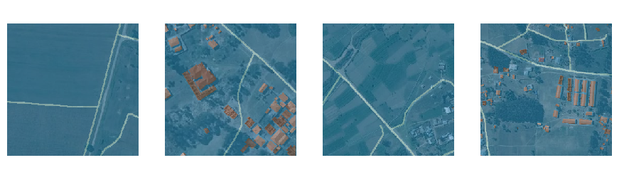
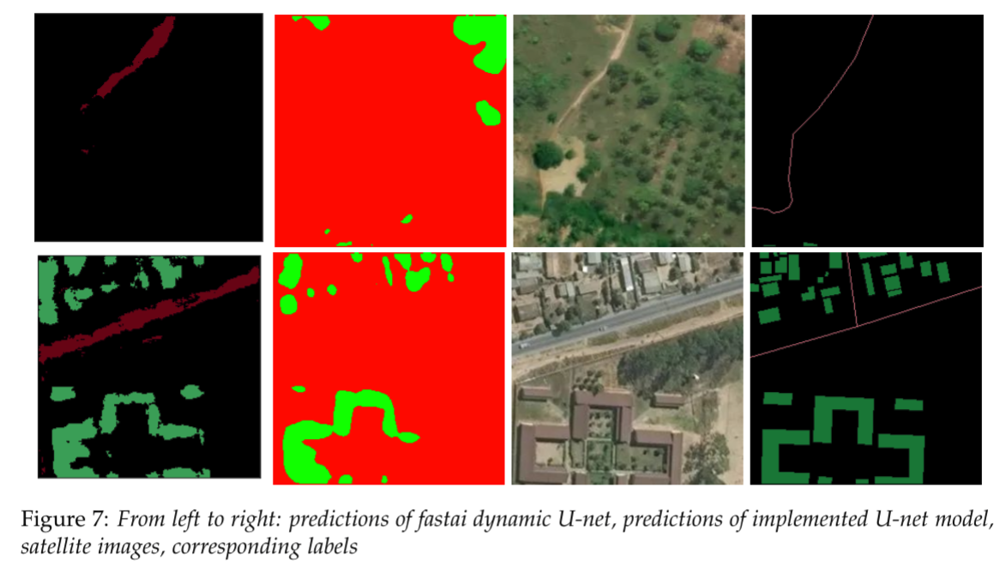
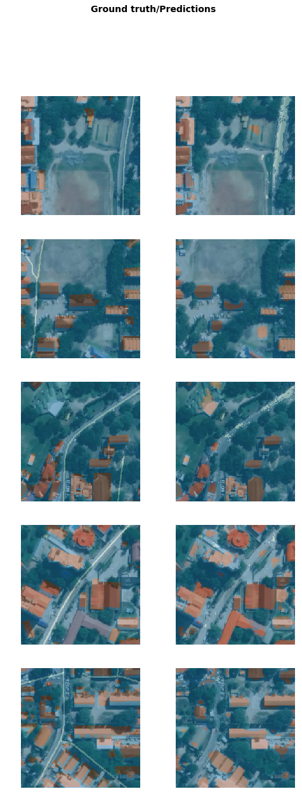

# SatelliteImagery
## Abstract
Many disasters occur in regions that are missing from the maps and the first responders lack information to make valuable decisions regarding their relief efforts. There is a collaborative project called Missing Maps which supports OpenStreetMap community in developing technologies, skills, work-flows, and communities. Currently, updating maps is a highly manual process requiring a large number of human labelers to either create features or rigorously validate generated outputs. As there have been several successful implementations of the image segmentation algorithms in the last few years, our project aims to utilize those advancements to make pixel-wise class predictions for highways and buildings. Our vision is to contribute to this worldwide mapping efforts by giving tools that can be used either to generate initial labels or to help identify possible mislabeling using satellite images.

The topic of this project is semantic segmentation  of  satellite  images. The goal is to classify the objects as buildings, highways, or background. We scraped the verified satellite images from OpenStreetMap using [`label-maker`](https://github.com/developmentseed/label-maker/) library that connects to OpenStreetMap API. First, we implemented a Convolutional Neural Network suitable for this task, inspired by the U-net architecture ([Ronneberger O., Fischer P., Brox T. (2015) U-Net: Convolutional Networks for Biomedical Image Segmentation.](https://link.springer.com/chapter/10.1007/978-3-319-24574-4_28)). Then we used dynamic U-net model from [`fastai`](https://docs.fast.ai/) library (which takes pretrained resnet34 as the encoder and generates the decoder part as first forward pass is completed). 

## Data
The quality of labels is not that good. First, some tiles are unlabeled, some have missing labels or are poorly labeled. Second, labels for some tiles are shifted +-5 pixels up/down, left/right.

## Results

| Model | IoU for buildings  | IoU for roads  | IoU for background  |
|---|---|---|---|
| Fastai dynamic U-net  | 0.389  | 0.094  | 0.843  |
| Tensorflow U-net (focal loss with weights)  | 0.381  | 0.000  | 0.861  |

More predictions from fastai:

*Created by Marina Zavalina, Peeyush Jain and Serkan Karakulak in 2018-19.   
Project for DS.GA.1001, NYU Center for Data Science.*
